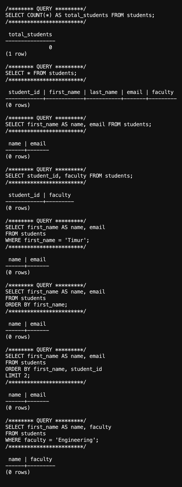

# Лабораторная работа 4

Азим Маматбаев

Тема: первые SQL-запросы.

Я выполнил запросы `SELECT` к таблице `university.public.students`: вывел все столбцы, отдельные столбцы, применил `WHERE`, `ORDER BY` и `LIMIT`. В материале лабораторной используется столбец `name`, а в моей таблице он называется `first_name`, поэтому в запросах я использовал `first_name AS name`. В примере `ORDER BY` не указан столбец сортировки; я указал `first_name`.

Результат: все запросы выполнились без ошибок. Таблица пока пустая (`COUNT(*) = 0`), поэтому выборки вернули 0 строк. Данные для результата я не добавлял.

[Вывод psql](lab4-result.txt)

[Мои SQL-команды](lab4.sql) · [Материал лабораторной](https://docs.google.com/document/d/10qSdz8lve4SAzF0mLsQW1yG2oGQPK1aX/edit)
