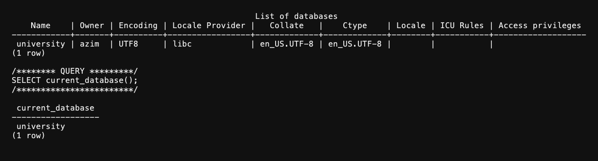

# Лабораторная работа 5

Азим Маматбаев

Тема: базы данных в PostgreSQL.

Я удалил базу `university`, которая осталась после предыдущей попытки, и создал её заново. Потом вывел список баз и подключился к `university` через `psql`.

Результат: команды `DROP DATABASE` и `CREATE DATABASE` выполнились успешно. В списке баз есть `university`, а `SELECT current_database()` вернул `university`.

[Вывод psql](lab5-result.txt)

[Мои SQL-команды](lab5.sql) · [Материал лабораторной](https://docs.google.com/document/d/1tACFw9v3Um6sak1ZjbQzxRur91qSvJKw/edit)
