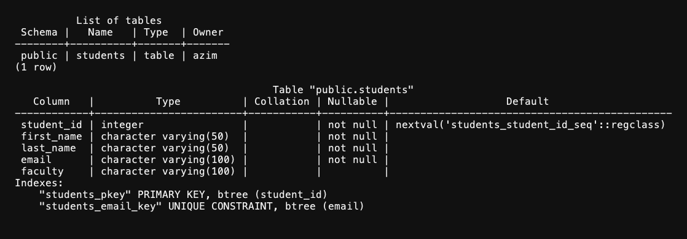

# Лабораторная работа 6

Азим Маматбаев

Тема: таблицы, типы данных и ограничения.

В базе `university` я создал таблицу `students` по примеру из файла: `student_id` — `SERIAL PRIMARY KEY`, имена — `VARCHAR(50) NOT NULL`, `email` — `VARCHAR(100) UNIQUE NOT NULL`, `faculty` — `VARCHAR(100)`. Команды `\dt` и `\d students` показали таблицу и её ограничения.

На отдельной `test_table` я выполнил действия из разделов про `ALTER TABLE` и `DROP TABLE`: добавил столбец, изменил тип, добавил `CHECK`, переименовал и удалил столбец, переименовал таблицу и удалил её. Также создал временную таблицу, которая исчезает после завершения сеанса.

Результат: в схеме `public` осталась только таблица `students` с пятью столбцами.

[Вывод psql](lab6-result.txt)

[Мои SQL-команды](lab6.sql) · [Материал лабораторной](https://docs.google.com/document/d/1VbzMZLRlmZaGdtf2FBgx3tjAhQRSBaNU/edit)
