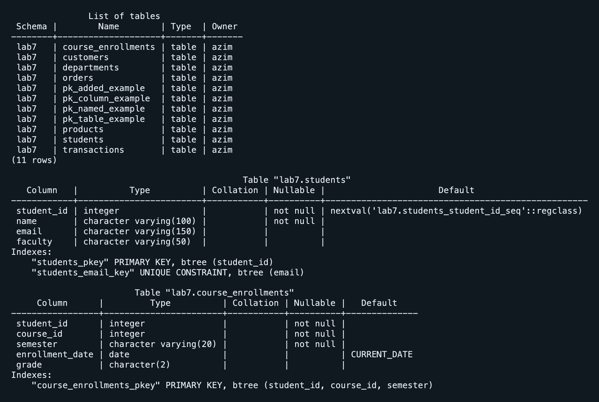
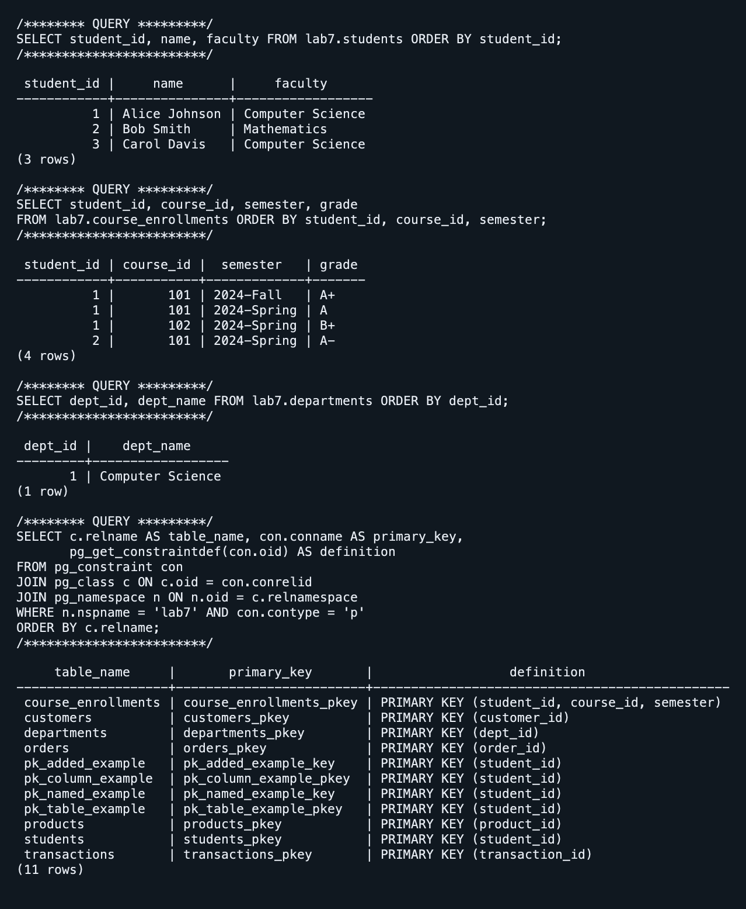

# Лабораторная работа 7

Азим Маматбаев

Тема: первичные ключи в PostgreSQL.

Я создал отдельную схему `lab7`, чтобы не менять таблицу `public.students` из прошлой работы. Проверил четыре способа объявления `PRIMARY KEY`: в столбце, в конце определения таблицы, с заданным именем и через `ALTER TABLE`. Затем сделал таблицы из методички с `SERIAL`, `BIGSERIAL`, `IDENTITY ALWAYS` и `IDENTITY BY DEFAULT`. В `students` и `course_enrollments` добавил ровно те учебные строки, которые приведены в файле.

Результат: простой ключ определяет студента, составной ключ (`student_id`, `course_id`, `semester`) позволяет одному студенту записаться на один курс в разные семестры. Повторный и пустой ключ в `departments` были отклонены PostgreSQL; лишние строки не сохранились.

[SQL работы](lab7.sql) · [Проверочные команды](verify.sql) · [Вывод psql](result.txt)

[Материал лабораторной](https://docs.google.com/document/d/1dDxnTfpofoXS5KFv2CgsM0r8ZP03imXZ/edit)
