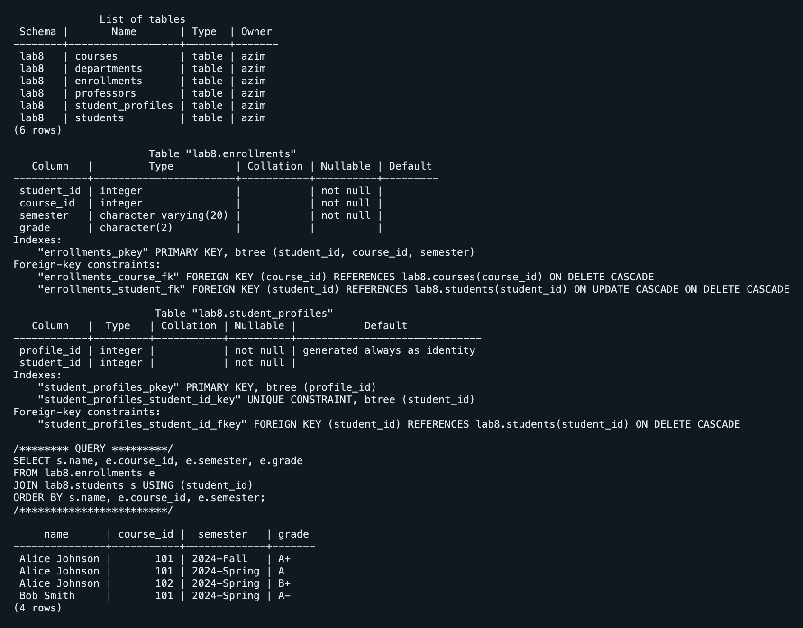

# Лабораторная работа 8

Азим Маматбаев

Тема: внешние ключи и связи таблиц.

В отдельной схеме `lab8` я связал студентов, курсы, преподавателей и факультеты. Идентификаторы студентов и курсов взял из учебных записей Lab 7, не придумывая новые. Связь один-к-одному показана таблицей `student_profiles` с `UNIQUE` внешним ключом, один-ко-многим — через `departments` и `professors`, многие-ко-многим — через `enrollments`.

Я создал внешние ключи прямо в определении столбца, отдельным ограничением в `CREATE TABLE` и через `ALTER TABLE`. В ограничениях есть `ON DELETE CASCADE`, `SET NULL`, `SET DEFAULT`, `RESTRICT` и `ON UPDATE CASCADE`. Попытка добавить запись с несуществующим студентом была отклонена; она не сохранилась.

[SQL работы](lab8.sql) · [Проверочные команды](verify.sql) · [Вывод psql](result.txt)

[Материал лабораторной](https://docs.google.com/document/d/1HLQfBeDeBlFqEo0Z8jtA9E8YW-AmAQfw/edit)
