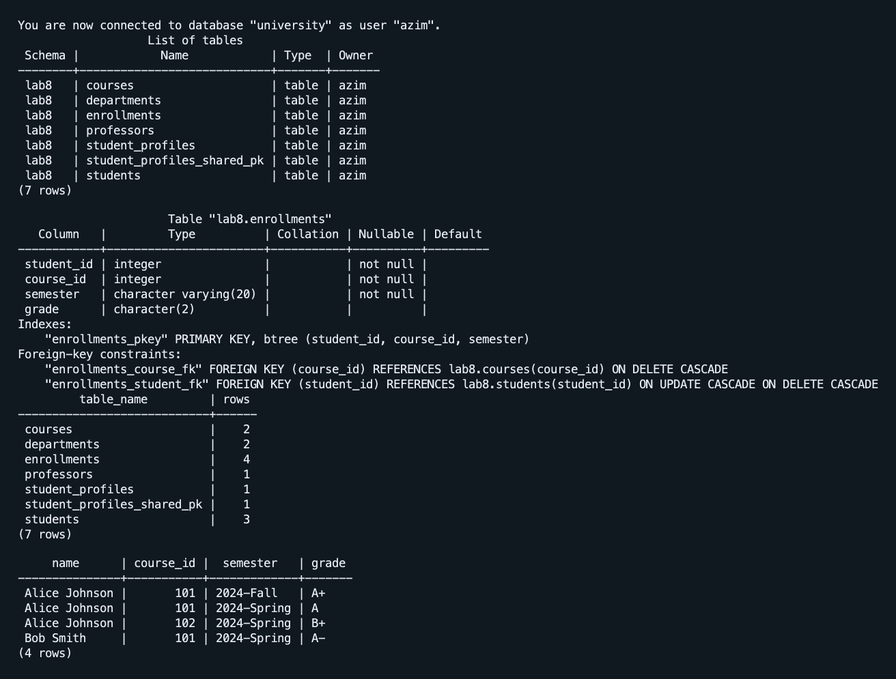
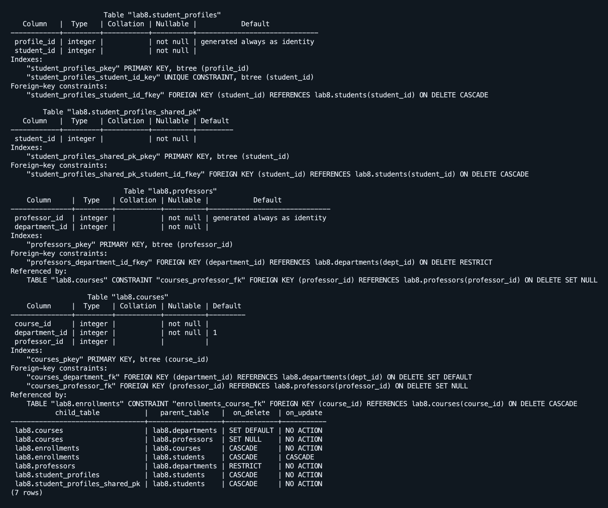
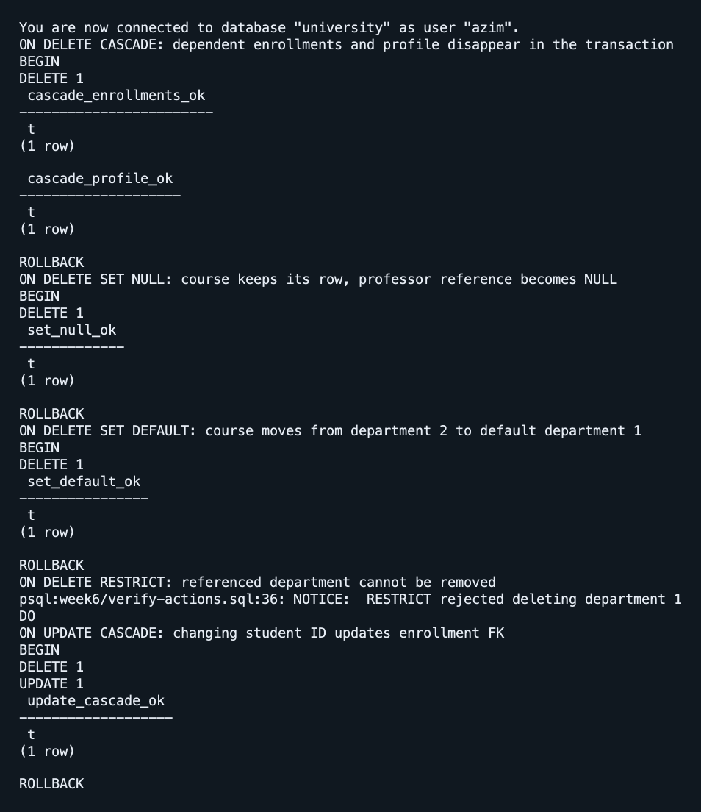

# Лабораторная работа 8

Азим Маматбаев

Тема: внешние ключи и связи таблиц.

В отдельной схеме `lab8` я связал студентов, курсы, преподавателей и факультеты. Идентификаторы студентов и курсов взял из учебных записей Lab 7. Связь один-к-одному показана двумя способами из файла: `student_profiles` с `UNIQUE` внешним ключом и `student_profiles_shared_pk` с общим первичным ключом. Один-ко-многим — через `departments` и `professors`, многие-ко-многим — через `enrollments`. В таблицах есть записи для каждого вида связи.

Я создал внешние ключи прямо в определении столбца, отдельным ограничением в `CREATE TABLE` и через `ALTER TABLE`. В ограничениях есть `ON DELETE CASCADE`, `SET NULL`, `SET DEFAULT`, `RESTRICT` и `ON UPDATE CASCADE`. Попытка добавить запись с несуществующим студентом была отклонена; она не сохранилась. Все пять действий с внешними ключами я проверил в транзакциях с `ROLLBACK`, поэтому учебные данные после проверки не изменились.

[SQL работы](lab8.sql) · [Дополнение существующей базы](complete-lab8.sql) · [Проверочные команды](verify.sql) · [Проверка действий FK](verify-actions.sql) · [Вывод psql](result.txt) · [Результаты проверки действий FK](actions-result.txt)

[Материал лабораторной](https://docs.google.com/document/d/1HLQfBeDeBlFqEo0Z8jtA9E8YW-AmAQfw/edit)
