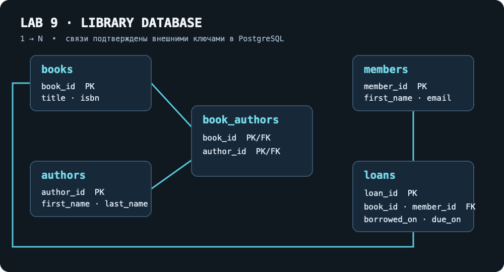

# Лабораторная работа 9

Азим Маматбаев

Тема: проектирование базы данных и нормализация.

По примеру из методички я спроектировал библиотеку: `books`, `authors`, `members`, `loans` и связующую таблицу `book_authors`. Книга может иметь нескольких авторов, участник может брать несколько книг; для выдачи хранятся даты получения, возврата и срока сдачи.

Я разделил данные на атомарные поля (1НФ). Названия книг и имена авторов не повторяются в `book_authors` и не зависят от части её составного ключа (2НФ). Данные участника хранятся в `members`, а в `loans` остаётся ссылка на него, без транзитивного дублирования (3НФ). Добавил первичные и внешние ключи, проверку дат и индекс по сроку сдачи. Учебных записей для библиотеки в файле нет, поэтому таблицы оставил пустыми.

[SQL работы](lab9.sql) · [Проверочные команды](verify.sql) · [Вывод psql](result.txt)

[ER-схема в SVG](library-erd.svg)

[Материал лабораторной](https://docs.google.com/document/d/1UjwMCGbcdKjChfTVb-8JA_Ixq6cw7IJQ/edit)
