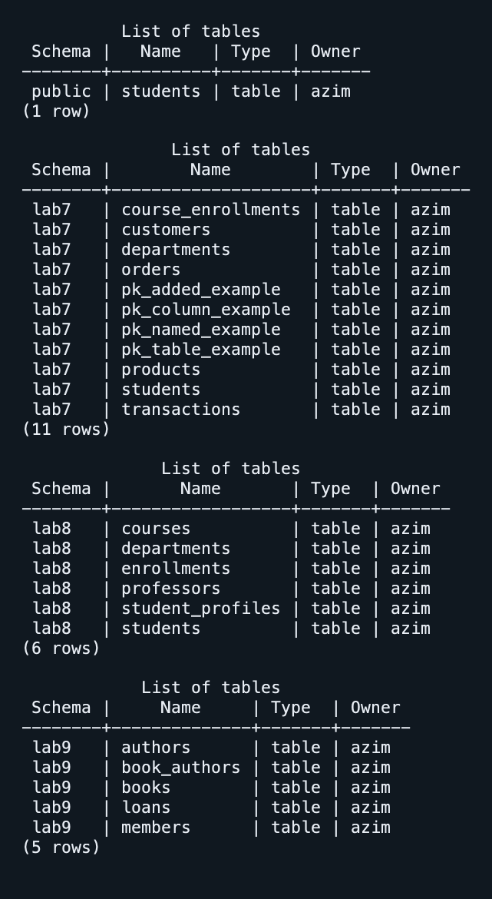
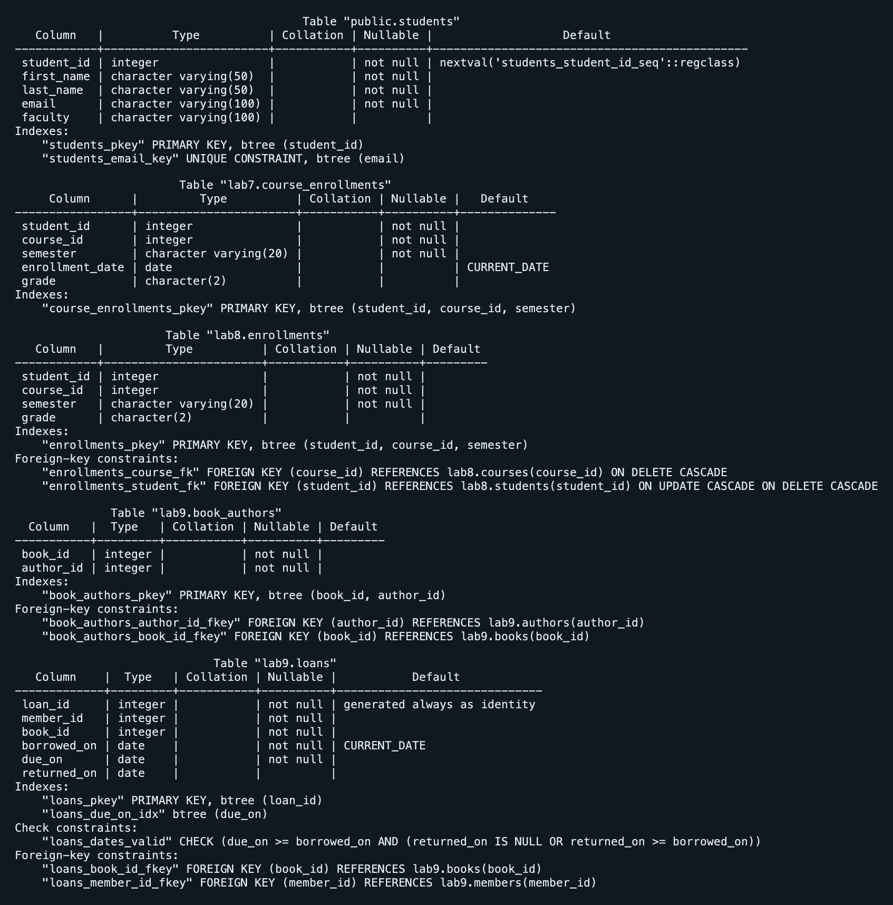
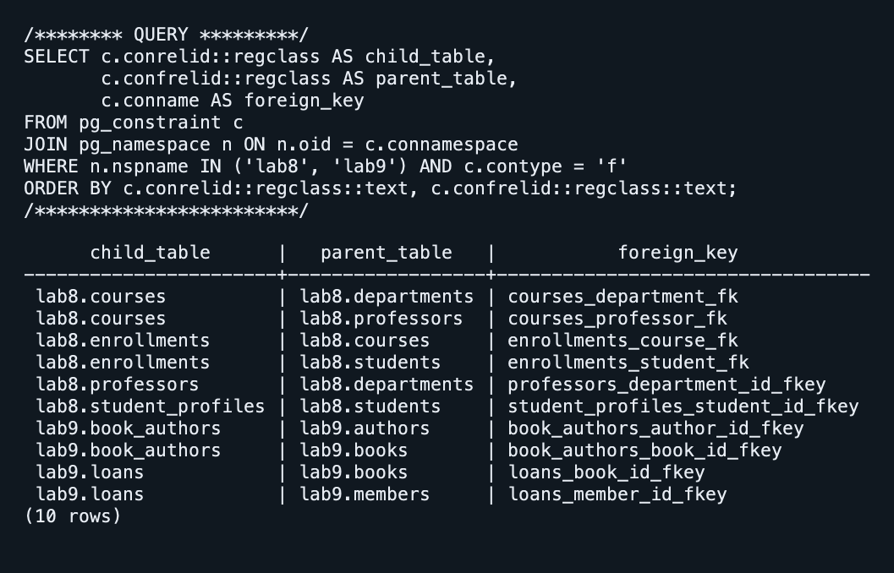
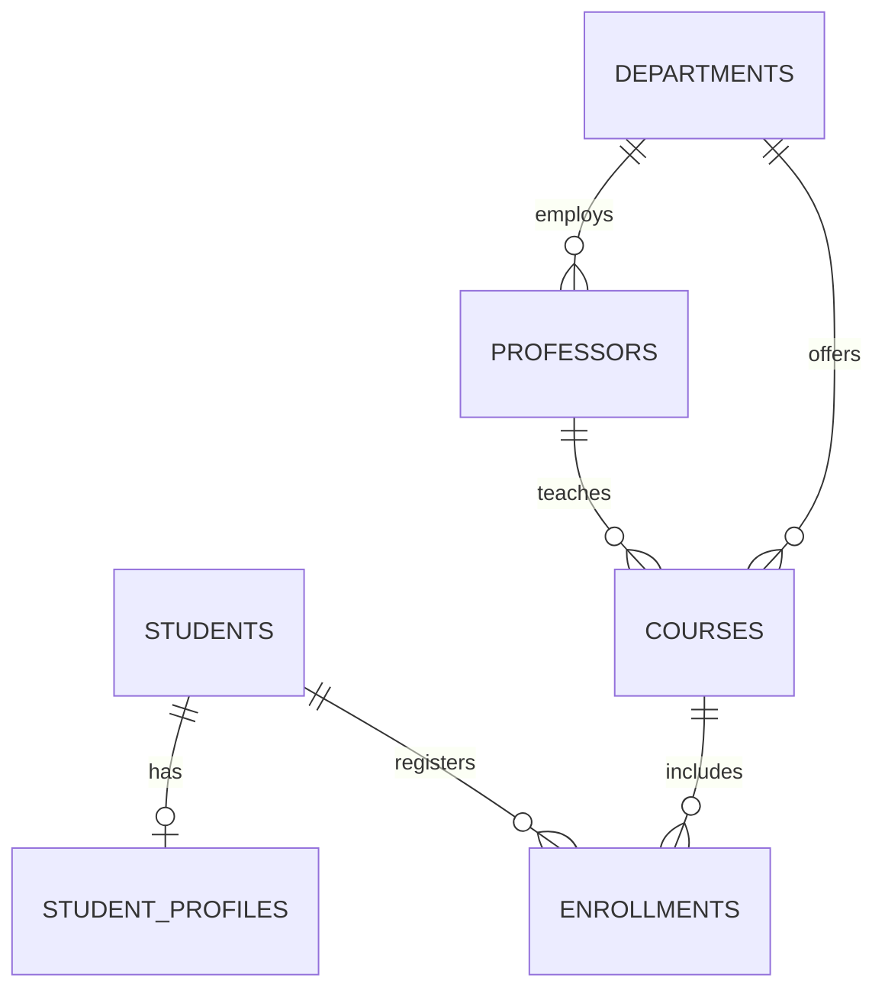

# Лабораторная работа 10

Азим Маматбаев

Тема: просмотр структуры базы данных.

Я проверил таблицы базы `university` командами `\dt`, а столбцы, типы, первичные и внешние ключи — командами `\d`. В отчёт вошли исходная `public.students` и схемы лабораторных 7–9. Отдельным запросом вывел пары таблиц, связанных внешними ключами, и по этим связям построил ER-схему.

Результат: таблицы и связи доступны в PostgreSQL; структура из предыдущих работ сохранилась. В этом задании я ничего не менял в базе.

[Команды проверки](lab10.sql) · [Вывод psql](result.txt)

В схеме выше показаны связи таблиц `lab8`; библиотечная ER-схема находится в Lab 9.

[Материал лабораторной](https://docs.google.com/document/d/10Mzs-G_WIk6rxG1QF6IywiR-CuzAKEPC/edit)
