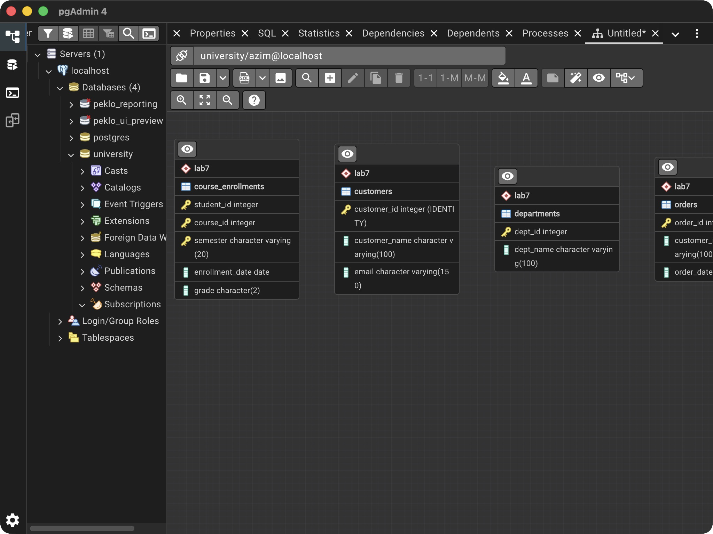
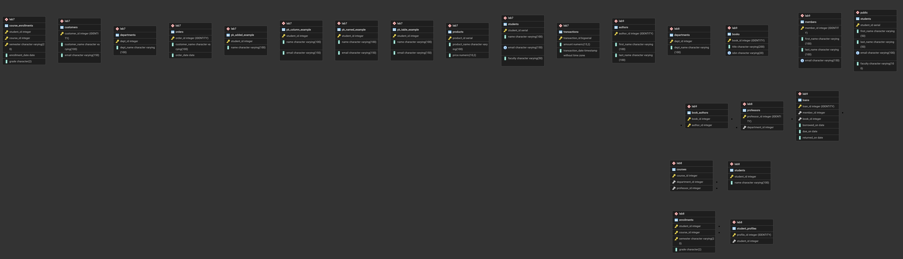

# Лабораторная работа 10

Азим Маматбаев

Тема: просмотр структуры базы данных.

Я проверил таблицы базы `university` командами `\dt`, а столбцы, типы, первичные и внешние ключи — командами `\d`. В отчёт вошли исходная `public.students` и схемы лабораторных 7–9. Отдельным запросом вывел пары таблиц, связанных внешними ключами. Затем в pgAdmin 4 выбрал базу `university` → `ERD For Database` и экспортировал диаграмму через `Download image`.

Результат: таблицы и связи доступны в PostgreSQL; структура из предыдущих работ сохранилась. В этом задании я ничего не менял в базе.

[Команды проверки](lab10.sql) · [Вывод psql](result.txt)

[Открыть диаграмму pgAdmin в полном размере](pgadmin-university-erd.png)

После дополнения Lab 8 база содержит 24 таблицы. Общий экспорт pgAdmin был сделан до добавления `lab8.student_profiles_shared_pk`, поэтому на нём показаны 23 таблицы. Актуальная структура всех 24 таблиц и список внешних ключей есть в [выводе psql](result.txt). Общий экспорт широкий, поэтому его лучше открыть в полном размере.

[Материал лабораторной](https://docs.google.com/document/d/10Mzs-G_WIk6rxG1QF6IywiR-CuzAKEPC/edit)
